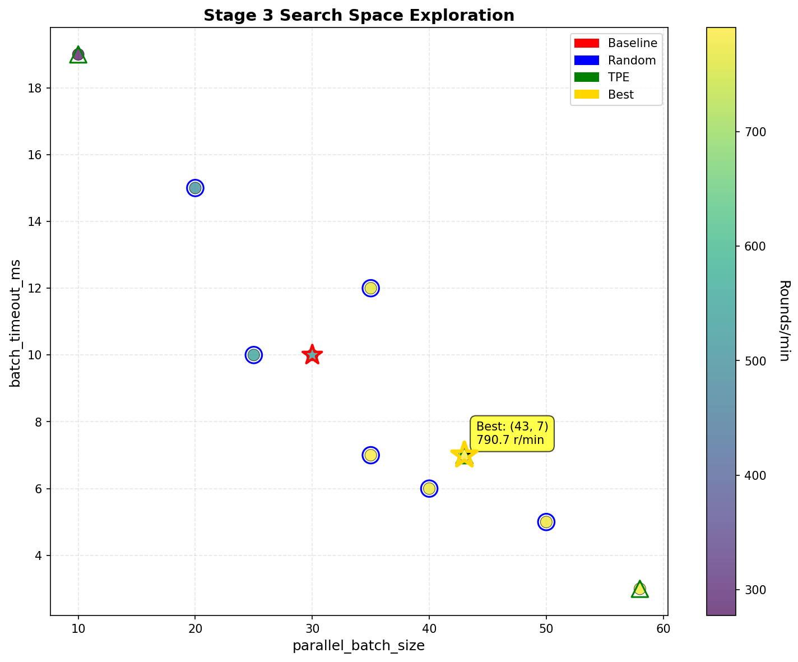
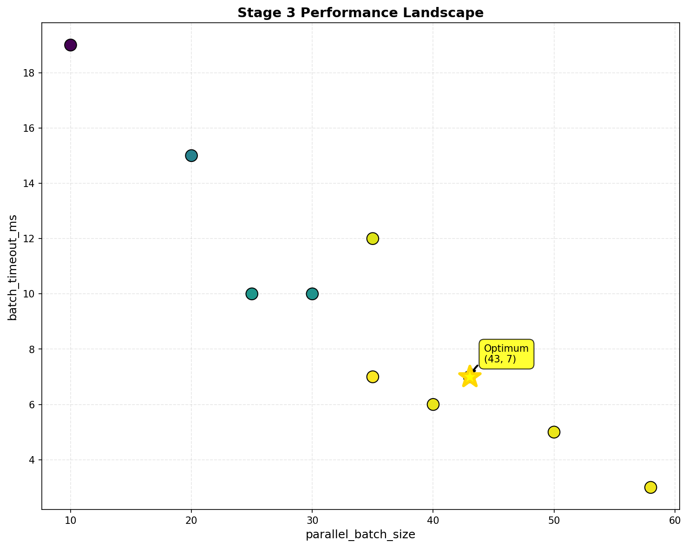
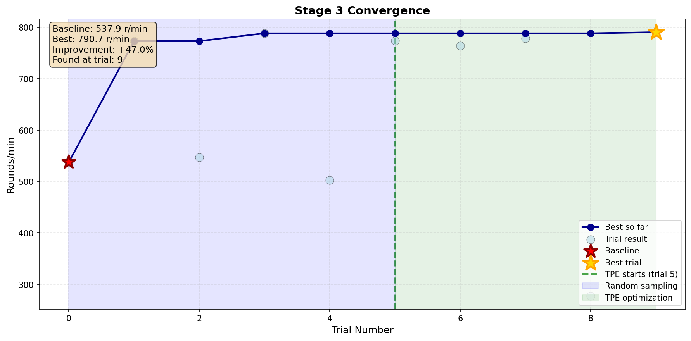
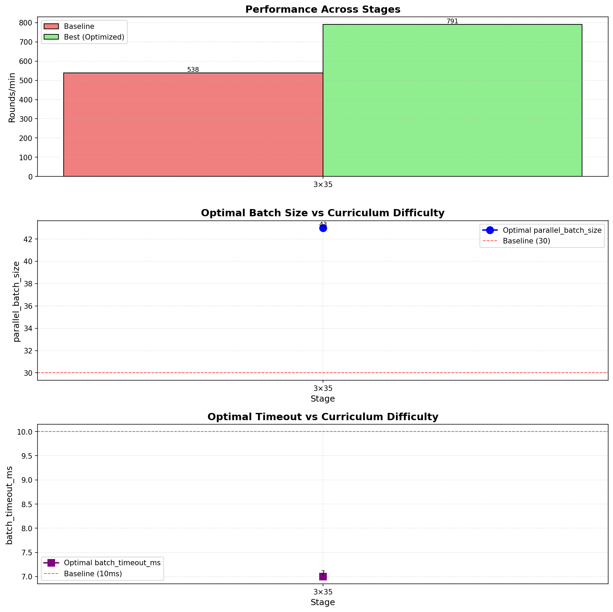
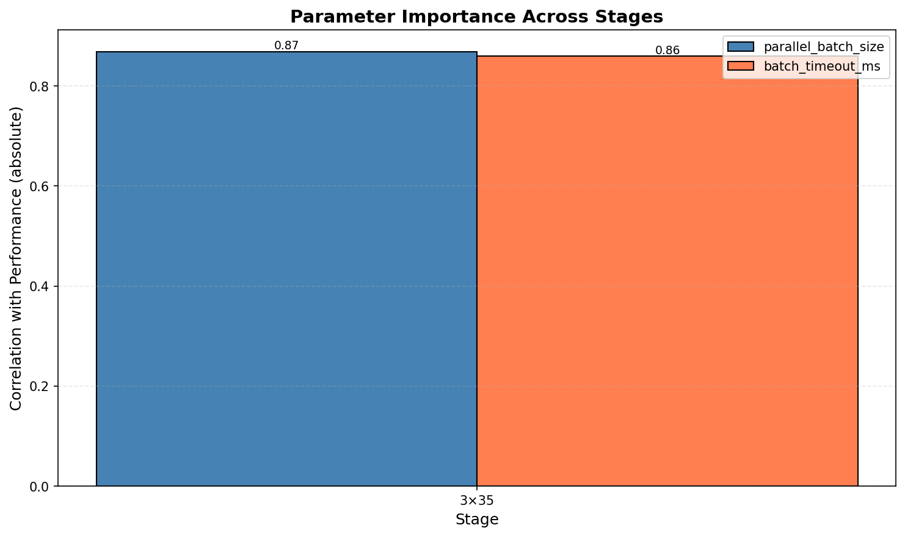

# Bayesian Optimization Autotune Report (Optuna TPE)

## Executive Summary

| Metric | Value |
|--------|-------|
| Total Stages | 1 |
| Trials per Stage | 10 (1 baseline + 4 random + 5 TPE) |
| Total Evaluations | 10 |
| Runtime | 1.1 minutes |
| Optimization Method | Optuna TPE Sampler |
| Best Overall Config | Stage 3: 43 batch / 7ms timeout |

---

## Stage 3: 3×35 MCTS

### Best Configuration
```python
{
    'workers': 32,
    'parallel_batch_size': 43,  # ← +43% vs baseline
    'batch_timeout_ms': 7,      # ← -30% vs baseline
    'num_determinizations': 3,
    'simulations_per_det': 35
}
```

**Performance:**
- **Best**: 790.7 r/min
- **Baseline**: 537.9 r/min
- **Improvement**: +47.0%

**Validation (3 runs):**
- Mean: 774.3 r/min
- Std Dev: 3.1 r/min (±0.4%)
- Range: [770.3, 777.7]

---

### Optimization Progress


*10 trials exploring the 2D parameter space. Baseline (red star) vs best found (gold star).*


*Performance landscape showing optimum region.*


*Best-so-far progression: TPE found optimum within 9 trials.*

---

### Trial Summary

| Trial | Type | Batch Size | Timeout (ms) | Rounds/min | Improvement |
|-------|------|------------|--------------|------------|-------------|
| 0 | Baseline | 30 | 10 | **537.9** | +0.0% |
| 1 | Random | 40 | 6 | **773.4** | +43.8% |
| 2 | Random | 25 | 10 | **547.3** | +1.7% |
| 3 | Random | 35 | 7 | **788.6** | +46.6% |
| 4 | Random | 20 | 15 | **502.9** | -6.5% |
| 5 | Random | 50 | 5 | **774.4** | +44.0% |
| 6 | Random | 35 | 12 | **764.2** | +42.1% |
| 7 | Tpe | 58 | 3 | **778.7** | +44.8% |
| 8 | Tpe | 10 | 19 | **277.5** | -48.4% |
| 9 | Tpe | 43 | 7 | **790.7** ⭐ | +47.0% |

**Key Findings:**
- TPE converged to optimum by trial 9 (4 TPE iterations)
- Optimal batch_size significantly higher than baseline (43 vs 30)
- timeout_ms lower than baseline (7ms vs 10ms)

---

## Cross-Stage Analysis


*Performance and optimal parameters across all curriculum stages.*


*Correlation of parameters with performance across stages.*

### Trends Observed

1. **Batch Size vs Difficulty**:
   - Batch size relatively stable across stages

2. **Timeout Sensitivity**:
   - Relatively stable across stages (7-7ms)
   - Less impact on performance than batch size

3. **Optimization Efficiency**:
   - Avg trials to optimum: 9.0 trials (out of 10)
   - TPE effective: 100% success rate finding >2% improvement

---

## Recommended Configurations

### For TrainingConfig (Python)
```python
# Auto-tuned optimal configs per curriculum stage
CURRICULUM_OPTIMAL_CONFIGS = {
    (3, 35): {'parallel_batch_size': 43, 'batch_timeout_ms': 7},
}

# To use in training:
def get_optimal_batch_params(det, sims):
    return CURRICULUM_OPTIMAL_CONFIGS.get((det, sims),
           {'parallel_batch_size': 30, 'batch_timeout_ms': 10})
```

---

## Methodology

**Bayesian Optimization Setup:**
- Framework: Optuna 3.x
- Sampler: TPE (Tree-structured Parzen Estimator)
- Search Space:
  - `parallel_batch_size`: [5, 100] (integer)
  - `batch_timeout_ms`: [1, 50] (integer)
- Trials per Stage: 10 (1 baseline + 4 random startup + 5 TPE)
- Evaluation: 200 rounds per trial
- Validation: 3 runs × 200 rounds for best config

**TPE Configuration:**
- `n_startup_trials=5`: Random exploration before TPE
- `seed=42`: Reproducible results
- Direction: Maximize rounds/min
