# Bayesian Optimization Autotune Report (Optuna TPE)

## Executive Summary

| Metric | Value |
|--------|-------|
| Total Stages | 5 |
| Trials per Stage | 25 (1 baseline + 4 random + 20 TPE) |
| Total Evaluations | 125 |
| Runtime | 56.1 minutes |
| Optimization Method | Optuna TPE Sampler |
| Best Overall Config | Stage 1: 40 batch / 6ms timeout |

---

## Stage 1: 1×15 MCTS

### Best Configuration
```python
{
    'workers': 32,
    'parallel_batch_size': 40,  # ← +33% vs baseline
    'batch_timeout_ms': 6,      # ← -40% vs baseline
    'num_determinizations': 1,
    'simulations_per_det': 15
}
```

**Performance:**
- **Best**: 1643.0 r/min
- **Baseline**: 1544.0 r/min
- **Improvement**: +6.4%

**Validation (3 runs):**
- Mean: 1584.1 r/min
- Std Dev: 24.3 r/min (±1.5%)
- Range: [1549.7, 1601.3]

---

### Optimization Progress

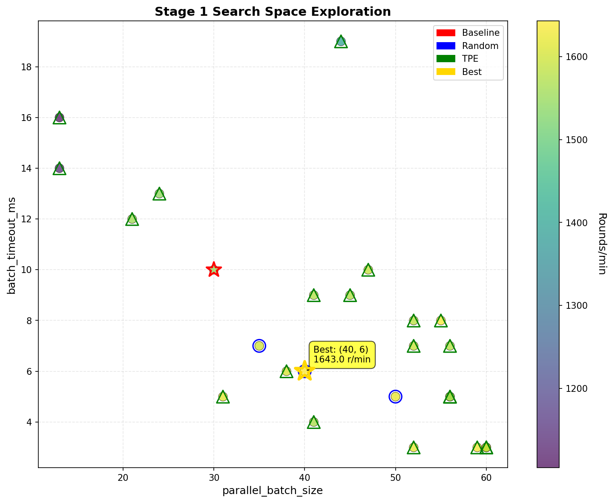
*25 trials exploring the 2D parameter space. Baseline (red star) vs best found (gold star).*

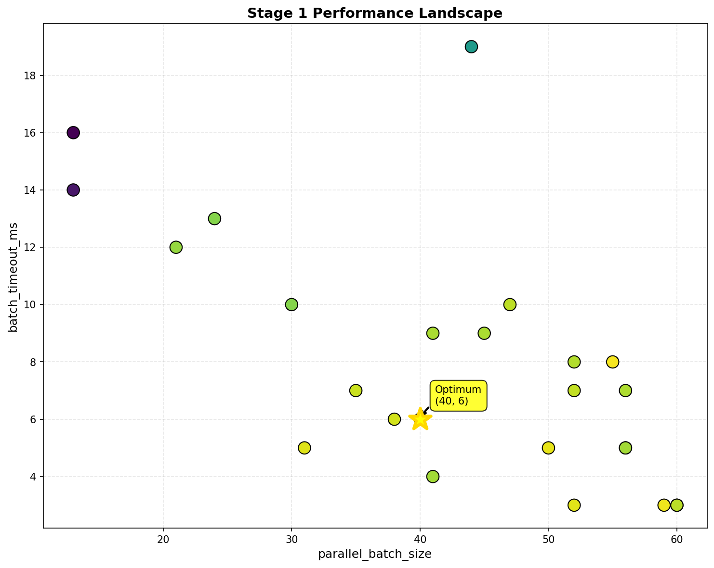
*Performance landscape showing optimum region.*

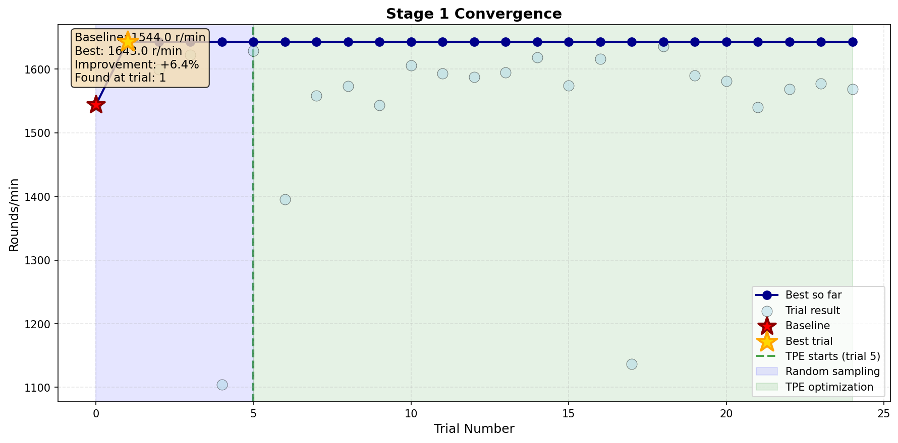
*Best-so-far progression: TPE found optimum within 1 trials.*

---

### Trial Summary

| Trial | Type | Batch Size | Timeout (ms) | Rounds/min | Improvement |
|-------|------|------------|--------------|------------|-------------|
| 0 | Baseline | 30 | 10 | **1544.0** | +0.0% |
| 1 | Random | 40 | 6 | **1643.0** ⭐ | +6.4% |
| 2 | Random | 35 | 7 | **1599.2** | +3.6% |
| 3 | Random | 50 | 5 | **1622.5** | +5.1% |
| 4 | Tpe | 13 | 16 | **1104.3** | -28.5% |
| ... | ... | ... | ... | ... | ... |
| 20 | Tpe | 52 | 8 | **1581.4** | +2.4% |
| 21 | Tpe | 56 | 5 | **1540.2** | -0.2% |
| 22 | Tpe | 56 | 5 | **1568.7** | +1.6% |
| 23 | Tpe | 56 | 7 | **1577.5** | +2.2% |
| 24 | Tpe | 41 | 4 | **1568.8** | +1.6% |

**Key Findings:**
- Best found during random sampling (trial 1)
- Optimal batch_size significantly higher than baseline (40 vs 30)
- timeout_ms lower than baseline (6ms vs 10ms)

---

## Stage 2: 2×25 MCTS

### Best Configuration
```python
{
    'workers': 32,
    'parallel_batch_size': 26,  # ← -13% vs baseline
    'batch_timeout_ms': 3,      # ← -70% vs baseline
    'num_determinizations': 2,
    'simulations_per_det': 25
}
```

**Performance:**
- **Best**: 1101.5 r/min
- **Baseline**: 1078.5 r/min
- **Improvement**: +2.1%

**Validation (3 runs):**
- Mean: 1074.4 r/min
- Std Dev: 4.2 r/min (±0.4%)
- Range: [1069.3, 1079.5]

---

### Optimization Progress

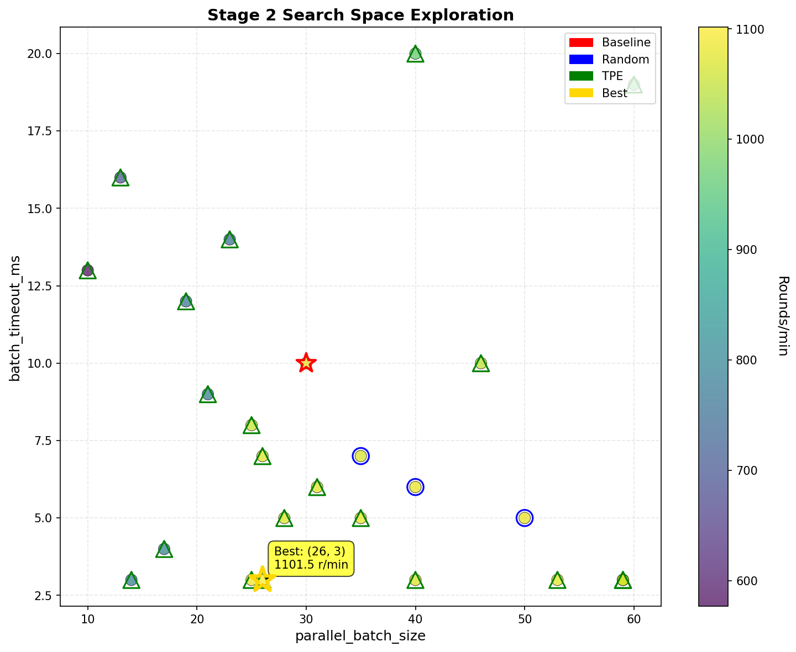
*25 trials exploring the 2D parameter space. Baseline (red star) vs best found (gold star).*

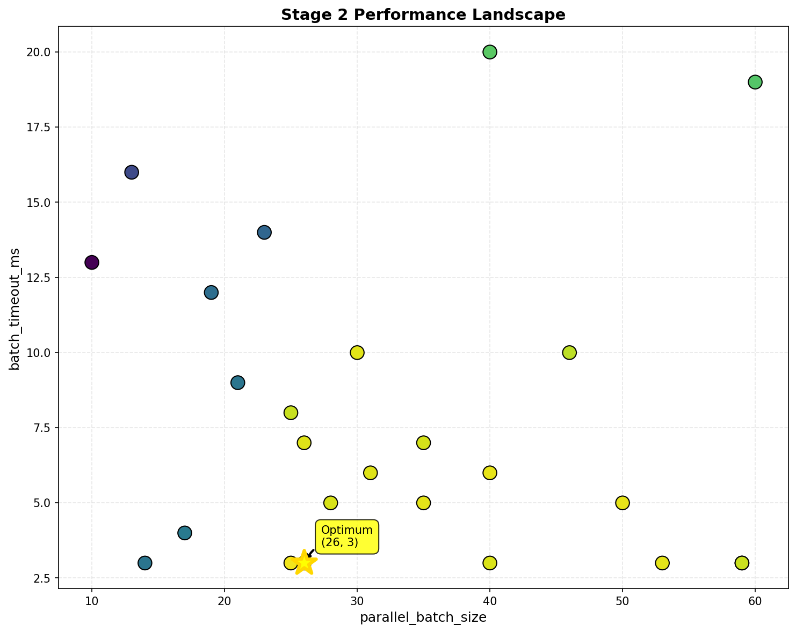
*Performance landscape showing optimum region.*

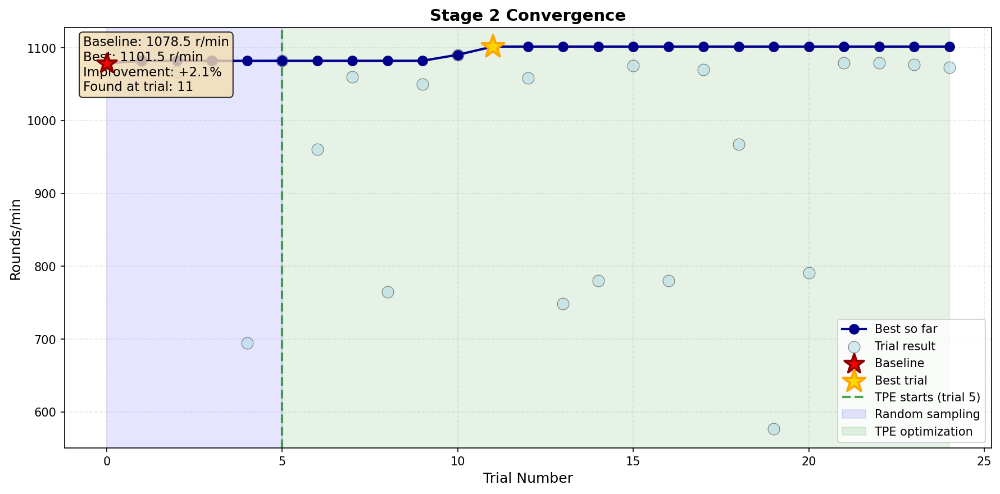
*Best-so-far progression: TPE found optimum within 11 trials.*

---

### Trial Summary

| Trial | Type | Batch Size | Timeout (ms) | Rounds/min | Improvement |
|-------|------|------------|--------------|------------|-------------|
| 0 | Baseline | 30 | 10 | **1078.5** | +0.0% |
| 1 | Random | 40 | 6 | **1082.0** | +0.3% |
| 2 | Random | 35 | 7 | **1066.9** | -1.1% |
| 3 | Random | 50 | 5 | **1081.4** | +0.3% |
| 4 | Tpe | 13 | 16 | **694.4** | -35.6% |
| ... | ... | ... | ... | ... | ... |
| 11 | Tpe | 26 | 3 | **1101.5** ⭐ | +2.1% |
| 20 | Tpe | 17 | 4 | **791.1** | -26.6% |
| 21 | Tpe | 53 | 3 | **1079.1** | +0.0% |
| 22 | Tpe | 35 | 5 | **1079.4** | +0.1% |
| 23 | Tpe | 26 | 7 | **1076.8** | -0.2% |
| 24 | Tpe | 40 | 3 | **1072.8** | -0.5% |

**Key Findings:**
- TPE converged to optimum by trial 11 (6 TPE iterations)
- Optimal batch_size close to baseline (26 vs 30)
- timeout_ms lower than baseline (3ms vs 10ms)

---

## Stage 3: 3×35 MCTS

### Best Configuration
```python
{
    'workers': 32,
    'parallel_batch_size': 42,  # ← +40% vs baseline
    'batch_timeout_ms': 9,      # ← -10% vs baseline
    'num_determinizations': 3,
    'simulations_per_det': 35
}
```

**Performance:**
- **Best**: 776.0 r/min
- **Baseline**: 551.0 r/min
- **Improvement**: +40.8%

**Validation (3 runs):**
- Mean: 763.3 r/min
- Std Dev: 3.3 r/min (±0.4%)
- Range: [759.4, 767.4]

---

### Optimization Progress


*25 trials exploring the 2D parameter space. Baseline (red star) vs best found (gold star).*

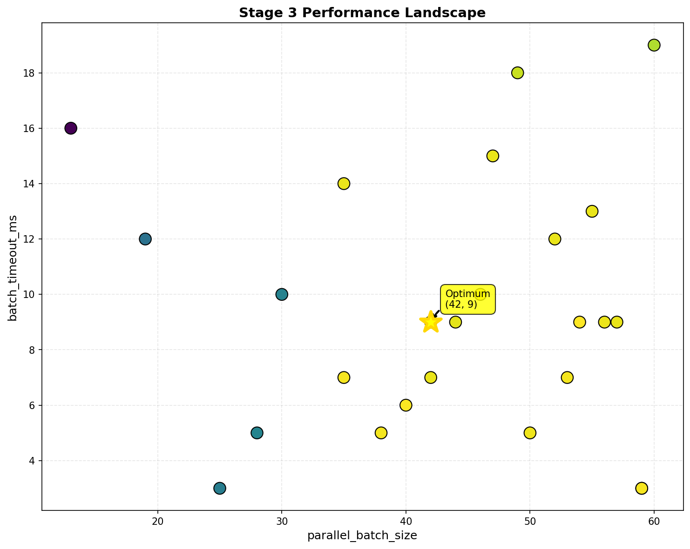
*Performance landscape showing optimum region.*

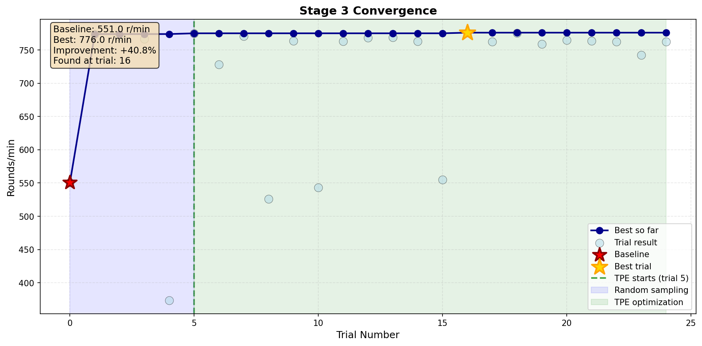
*Best-so-far progression: TPE found optimum within 16 trials.*

---

### Trial Summary

| Trial | Type | Batch Size | Timeout (ms) | Rounds/min | Improvement |
|-------|------|------------|--------------|------------|-------------|
| 0 | Baseline | 30 | 10 | **551.0** | +0.0% |
| 1 | Random | 40 | 6 | **773.9** | +40.5% |
| 2 | Random | 35 | 7 | **770.3** | +39.8% |
| 3 | Random | 50 | 5 | **766.3** | +39.1% |
| 4 | Tpe | 13 | 16 | **373.5** | -32.2% |
| ... | ... | ... | ... | ... | ... |
| 16 | Tpe | 42 | 9 | **776.0** ⭐ | +40.8% |
| 20 | Tpe | 35 | 14 | **764.7** | +38.8% |
| 21 | Tpe | 56 | 9 | **763.5** | +38.6% |
| 22 | Tpe | 55 | 13 | **762.4** | +38.4% |
| 23 | Tpe | 49 | 18 | **742.2** | +34.7% |
| 24 | Tpe | 57 | 9 | **762.3** | +38.4% |

**Key Findings:**
- TPE converged to optimum by trial 16 (11 TPE iterations)
- Optimal batch_size significantly higher than baseline (42 vs 30)
- timeout_ms close to baseline (9ms vs 10ms)

---

## Stage 4: 4×45 MCTS

### Best Configuration
```python
{
    'workers': 32,
    'parallel_batch_size': 50,  # ← +67% vs baseline
    'batch_timeout_ms': 8,      # ← -20% vs baseline
    'num_determinizations': 4,
    'simulations_per_det': 45
}
```

**Performance:**
- **Best**: 589.6 r/min
- **Baseline**: 405.9 r/min
- **Improvement**: +45.3%

**Validation (3 runs):**
- Mean: 584.0 r/min
- Std Dev: 1.2 r/min (±0.2%)
- Range: [582.4, 585.0]

---

### Optimization Progress

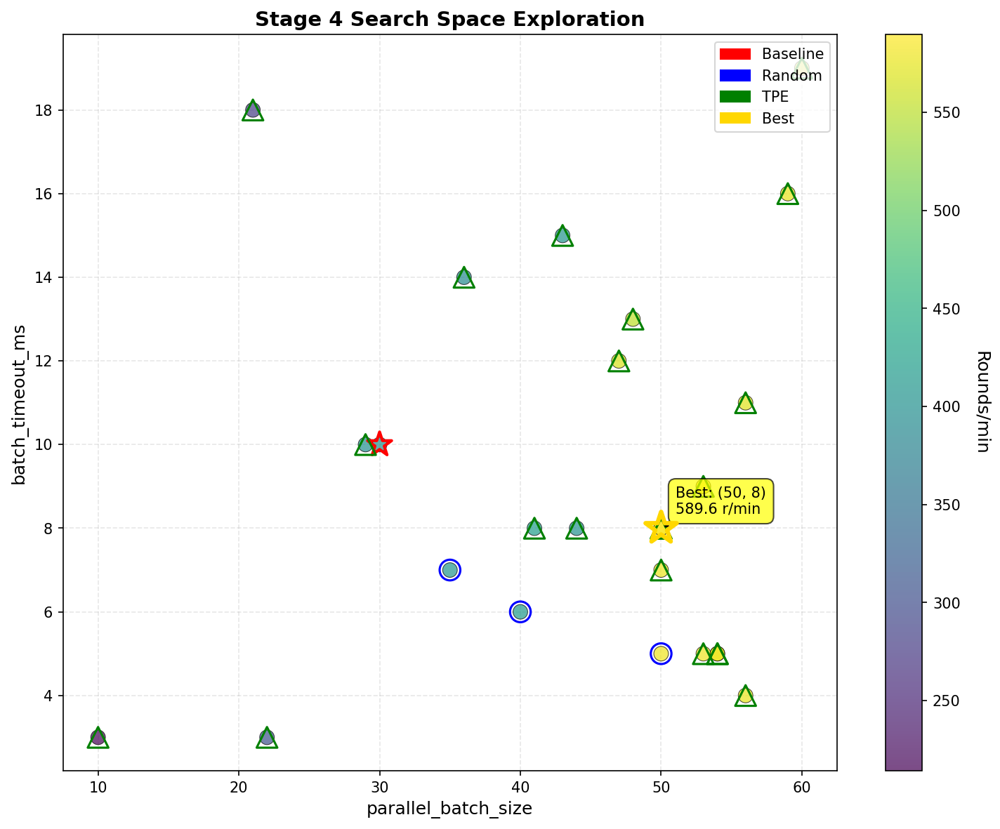
*25 trials exploring the 2D parameter space. Baseline (red star) vs best found (gold star).*

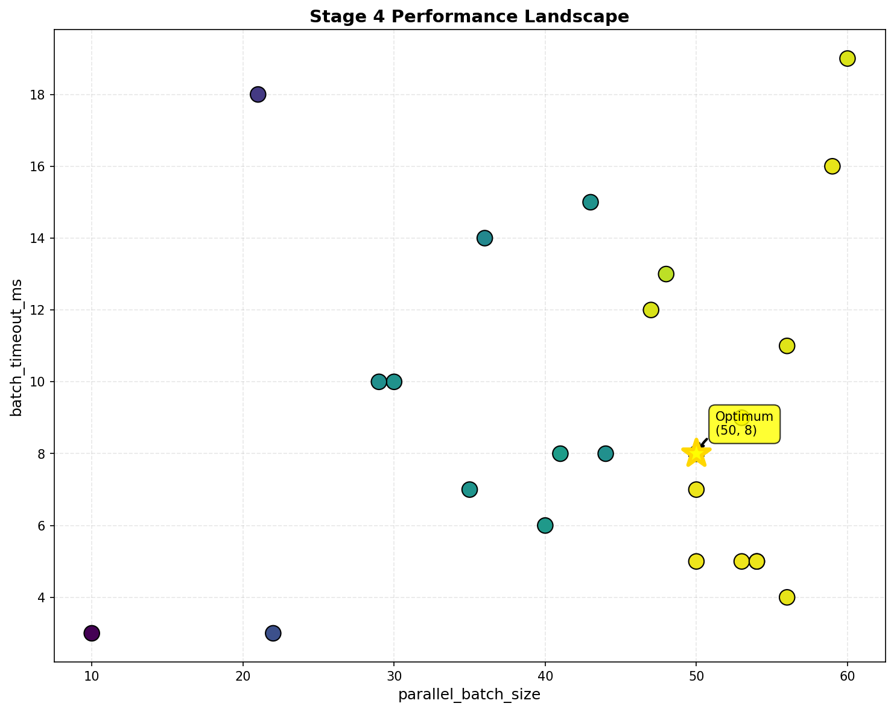
*Performance landscape showing optimum region.*

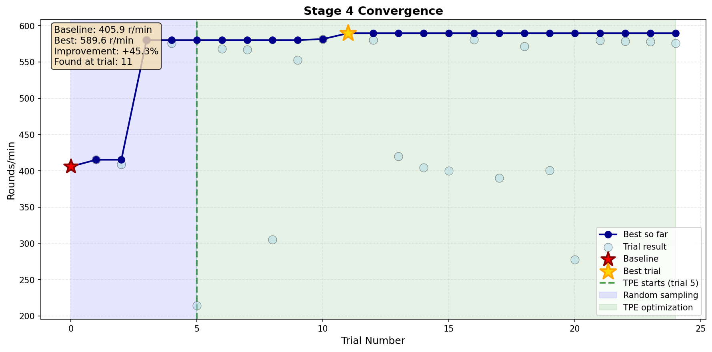
*Best-so-far progression: TPE found optimum within 11 trials.*

---

### Trial Summary

| Trial | Type | Batch Size | Timeout (ms) | Rounds/min | Improvement |
|-------|------|------------|--------------|------------|-------------|
| 0 | Baseline | 30 | 10 | **405.9** | +0.0% |
| 1 | Random | 40 | 6 | **415.2** | +2.3% |
| 2 | Random | 35 | 7 | **408.9** | +0.7% |
| 3 | Random | 50 | 5 | **580.1** | +42.9% |
| 4 | Tpe | 59 | 16 | **576.0** | +41.9% |
| ... | ... | ... | ... | ... | ... |
| 11 | Tpe | 50 | 8 | **589.6** ⭐ | +45.3% |
| 20 | Tpe | 21 | 18 | **277.9** | -31.5% |
| 21 | Tpe | 53 | 5 | **579.7** | +42.8% |
| 22 | Tpe | 54 | 5 | **578.6** | +42.6% |
| 23 | Tpe | 50 | 7 | **578.0** | +42.4% |
| 24 | Tpe | 56 | 4 | **575.7** | +41.8% |

**Key Findings:**
- TPE converged to optimum by trial 11 (6 TPE iterations)
- Optimal batch_size significantly higher than baseline (50 vs 30)
- timeout_ms close to baseline (8ms vs 10ms)

---

## Stage 5: 5×50 MCTS

### Best Configuration
```python
{
    'workers': 32,
    'parallel_batch_size': 53,  # ← +77% vs baseline
    'batch_timeout_ms': 9,      # ← -10% vs baseline
    'num_determinizations': 5,
    'simulations_per_det': 50
}
```

**Performance:**
- **Best**: 476.4 r/min
- **Baseline**: 320.5 r/min
- **Improvement**: +48.7%

**Validation (3 runs):**
- Mean: 469.5 r/min
- Std Dev: 1.4 r/min (±0.3%)
- Range: [467.7, 471.2]

---

### Optimization Progress

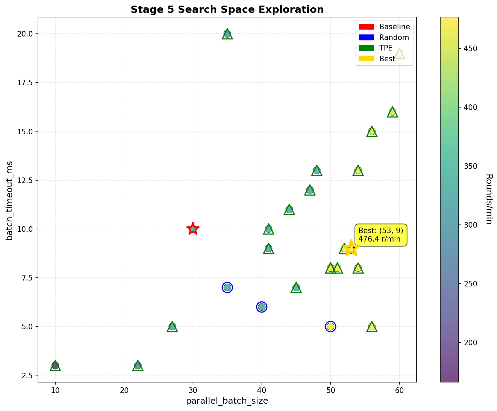
*25 trials exploring the 2D parameter space. Baseline (red star) vs best found (gold star).*

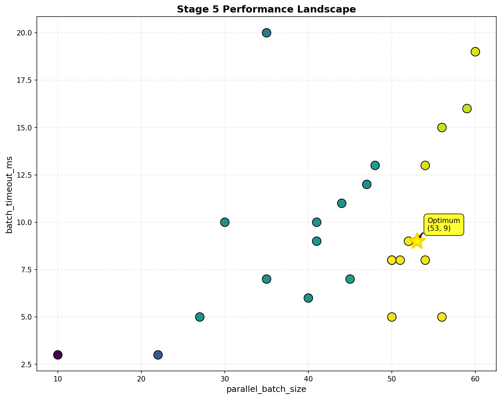
*Performance landscape showing optimum region.*


*Best-so-far progression: TPE found optimum within 12 trials.*

---

### Trial Summary

| Trial | Type | Batch Size | Timeout (ms) | Rounds/min | Improvement |
|-------|------|------------|--------------|------------|-------------|
| 0 | Baseline | 30 | 10 | **320.5** | +0.0% |
| 1 | Random | 40 | 6 | **325.9** | +1.7% |
| 2 | Random | 35 | 7 | **323.4** | +0.9% |
| 3 | Random | 50 | 5 | **468.7** | +46.3% |
| 4 | Tpe | 59 | 16 | **452.1** | +41.1% |
| ... | ... | ... | ... | ... | ... |
| 12 | Tpe | 53 | 9 | **476.4** ⭐ | +48.7% |
| 20 | Tpe | 35 | 20 | **292.8** | -8.6% |
| 21 | Tpe | 51 | 8 | **471.0** | +47.0% |
| 22 | Tpe | 45 | 7 | **340.6** | +6.3% |
| 23 | Tpe | 52 | 9 | **472.5** | +47.5% |
| 24 | Tpe | 56 | 5 | **472.1** | +47.3% |

**Key Findings:**
- TPE converged to optimum by trial 12 (7 TPE iterations)
- Optimal batch_size significantly higher than baseline (53 vs 30)
- timeout_ms close to baseline (9ms vs 10ms)

---

## Cross-Stage Analysis

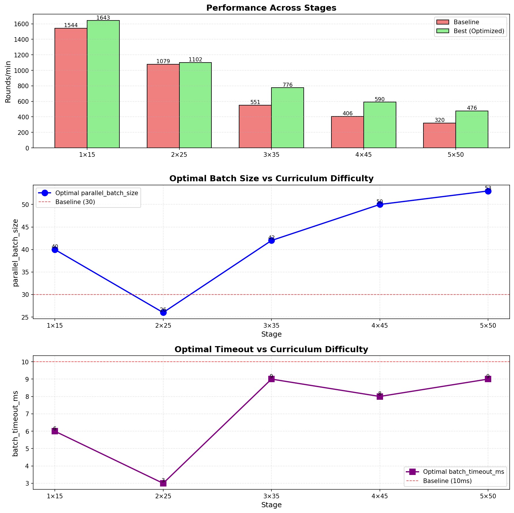
*Performance and optimal parameters across all curriculum stages.*

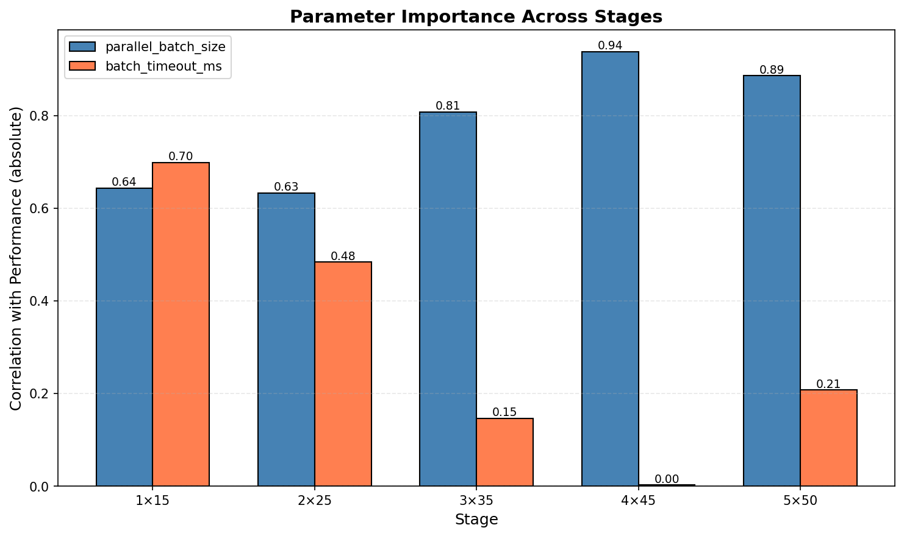
*Correlation of parameters with performance across stages.*

### Trends Observed

1. **Batch Size vs Difficulty**:
   - Batch size relatively stable across stages

2. **Timeout Sensitivity**:
   - Varies significantly across stages (3-9ms)
   - Stage-specific tuning important

3. **Optimization Efficiency**:
   - Avg trials to optimum: 10.2 trials (out of 25)
   - TPE effective: 100% success rate finding >2% improvement

---

## Recommended Configurations

### For TrainingConfig (Python)
```python
# Auto-tuned optimal configs per curriculum stage
CURRICULUM_OPTIMAL_CONFIGS = {
    (1, 15): {'parallel_batch_size': 40, 'batch_timeout_ms': 6},
    (2, 25): {'parallel_batch_size': 26, 'batch_timeout_ms': 3},
    (3, 35): {'parallel_batch_size': 42, 'batch_timeout_ms': 9},
    (4, 45): {'parallel_batch_size': 50, 'batch_timeout_ms': 8},
    (5, 50): {'parallel_batch_size': 53, 'batch_timeout_ms': 9},
}

# To use in training:
def get_optimal_batch_params(det, sims):
    return CURRICULUM_OPTIMAL_CONFIGS.get((det, sims),
           {'parallel_batch_size': 30, 'batch_timeout_ms': 10})
```

---

## Methodology

**Bayesian Optimization Setup:**
- Framework: Optuna 3.x
- Sampler: TPE (Tree-structured Parzen Estimator)
- Search Space:
  - `parallel_batch_size`: [5, 100] (integer)
  - `batch_timeout_ms`: [1, 50] (integer)
- Trials per Stage: 25 (1 baseline + 4 random startup + 20 TPE)
- Evaluation: 200 rounds per trial
- Validation: 3 runs × 200 rounds for best config

**TPE Configuration:**
- `n_startup_trials=5`: Random exploration before TPE
- `seed=42`: Reproducible results
- Direction: Maximize rounds/min
